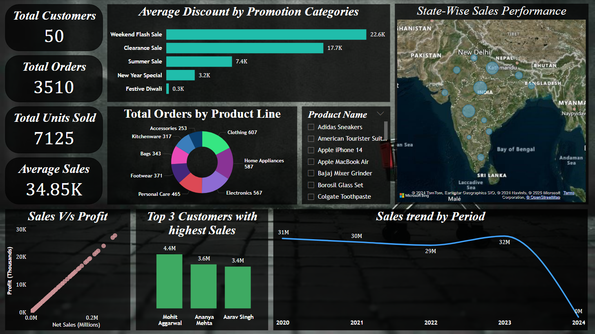
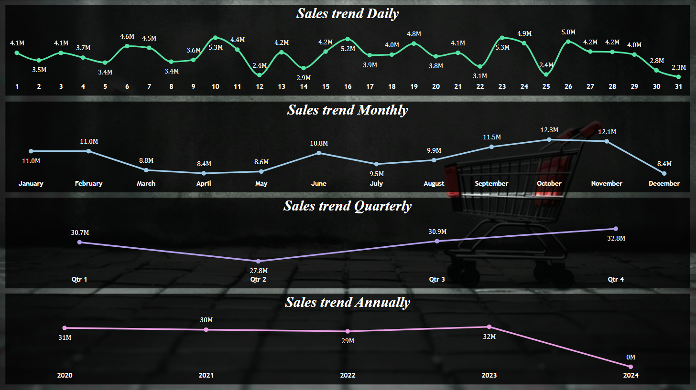
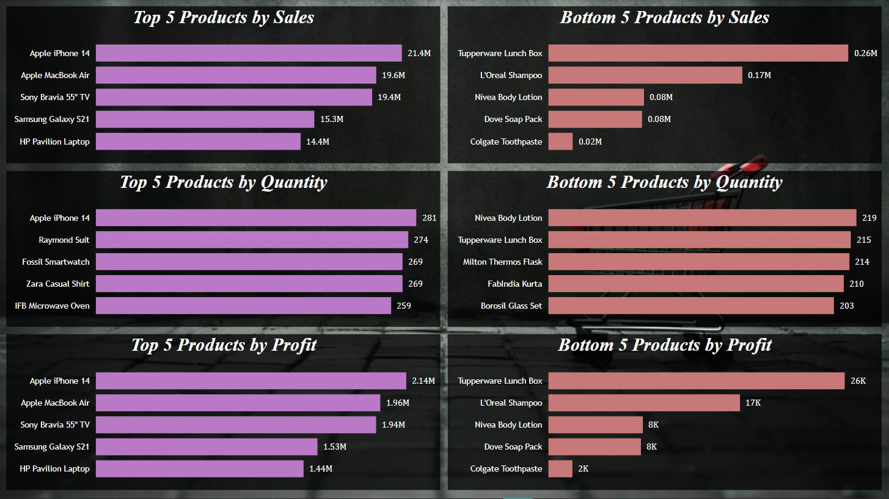
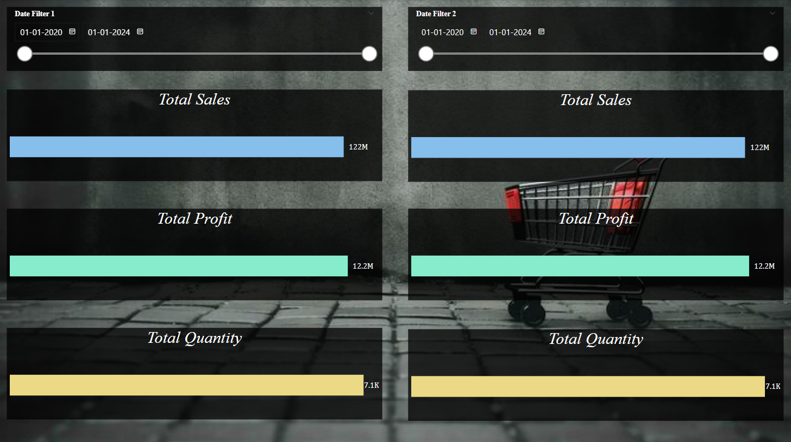
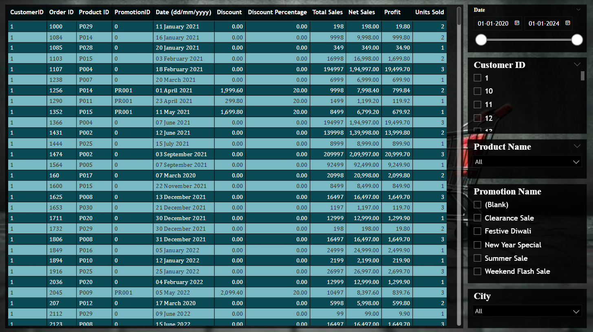

# Sales Analysis Dashboard

## 🌟 Introduction
The **Sales Analysis Dashboard** is a dynamic and interactive Power BI project designed to uncover valuable insights from sales data. This project demonstrates expertise in data transformation, DAX calculations, and interactive visual storytelling. It aims to empower businesses by presenting actionable insights about customers, products, promotions, and sales trends.

## 🚀 Project Overview
This project analyzes sales data from a hypothetical store using Power BI. The goal is to enable stakeholders to identify patterns, track performance, and make informed decisions. The process includes:
- **Data Profiling & Transformation**: Cleaned, merged, and transformed data using Power Query.
- **Interactive Dashboards**: Created highly interactive visualizations across six report pages.
- **Key Business Insights**: Derived actionable insights using calculated metrics and relationships.

## 📂 Dataset Details
**File Name:** `Store+Data.xlsx`  
The dataset consists of four sheets:
1. **Dim Customers**: Customer details (`Customer ID`, `Customer Name`, `City`, `State`, `Pincode`, `EmailID`, `Phone Number`).
2. **Dim Product**: Product details (`ProductID`, `Product Name`, `Product Line`, `Price Per Unit (INR)`).
3. **Dim Promotion**: Promotion details (`PromotionID`, `Promotion Name`, `Ad Type`, `Coupon Code`, `Price Reduction Type`, `Percentage`).
4. **Fact Table**: Order details (`OrderID`, `Date`, `CustomerID`, `PromotionID`, `ProductID`, `Units Sold`, `Price Per Unit`, `Total Sales`, `Discount Percentage`, `Discount Value`, `Net Sales`, `Profit`).

## 🔧 Data Transformation
### Key Steps:
- **Index Column**: Added OrderID as a unique identifier starting from 1.
- **Merging Queries**: Joined fact table with dimension tables to enrich data.
- **Calculated Columns**:
  - `Total Sales` = `Units Sold * Price Per Unit`
  - `Discount Value` = Calculated using `Discount Percentage`
  - `Net Sales` = `Total Sales - Discount Value`
  - `Profit` = `Net Sales * 10%` (assumed).
- **Data Profiling**: Ensured data quality by handling null values and duplicates.
- **Relationship Setup**: Established 1-to-many relationships for smooth interaction between tables.

## 📊 Report Pages & Visualizations
### 1. **Start**

- **Purpose**: Introduces the project and provides a "Start" button for navigation to the Overview page.

### 2. **Overview**

- **Visuals**:
  - **Cards**: Summarize `Total Customers`, `Total Orders`, `Total Units Sold`, and `Average Net Sales`.
  - **Clustered Bar Chart**: Highlights average discount by promotion categories.
  - **Map**: Displays net sales by state with bubble size indicating sales volume.
  - **Donut Chart**: Illustrates the distribution of total orders by product line.
  - **Scatter Plot**: Analyzes the relationship between Sales and Profit.
  - **Stacked Column Chart**: Identifies top 3 customers with the highest sales.
  - **Line Chart**: Depicts sales trends over time, with drill-down capabilities.
  - **Slicer**: Enables filtering by product names for dynamic analysis.

### 3. **Trends**

- **Line Charts**: Visualize net sales trends across daily, monthly, quarterly, and yearly intervals.

### 4. **Product Analysis**

- **Stacked Bar Charts**:
  - Show top 5 products by `Sales`, `Quantity`, and `Profit`.
  - Highlight bottom 5 products by the same metrics.

### 5. **Dynamic Comparison**

- **Date Slicers**: Allow users to compare metrics across two selected periods.
- **Bar Charts**: Represent `Total Sales`, `Total Profit`, and `Total Quantity` for each selected period.

### 6. **Detailed Breakdown**

- **Table**: Provides a comprehensive view of transactional data.
- **Slicers**: Enable filtering by `Date`, `Customer ID`, `Product Name`, `Promotion Name`, and `City`.
- **Custom Measure**: Ensures slicers interact seamlessly for dynamic filtering.

## 🌟 Key Insights
1. **Top Products**: Identified top and bottom performing products by sales, quantity, and profit.
2. **Promotion Effectiveness**: Analyzed the impact of discounts and promotions.
3. **Customer Trends**: Highlighted top-performing customers by sales.
4. **Geographic Insights**: States and cities driving the most sales.
5. **Sales Trends**: Analyzed sales trends over time.
6. **Dynamic Comparisons**: Enabled dynamic comparisons to track performance across different time periods.

## 📁 Files
- **`Store+Data.xlsx`**: Raw dataset.
- **`Sales Analysis.pbix`**: Power BI file with all transformations and visualizations.

## 🛠 How to Run the Project
1. Download `Store+Data.xlsx` and `Sales Analysis.pbix`.
2. Open the `.pbix` file in Power BI Desktop.
3. Refresh the data source to reconnect with the dataset.
4. Explore the interactive dashboards and uncover insights.

## 🤝 Contributions
Suggestions and contributions are highly welcome! If you have ideas to improve the dashboard or add more features, feel free to raise an issue or submit a pull request.
